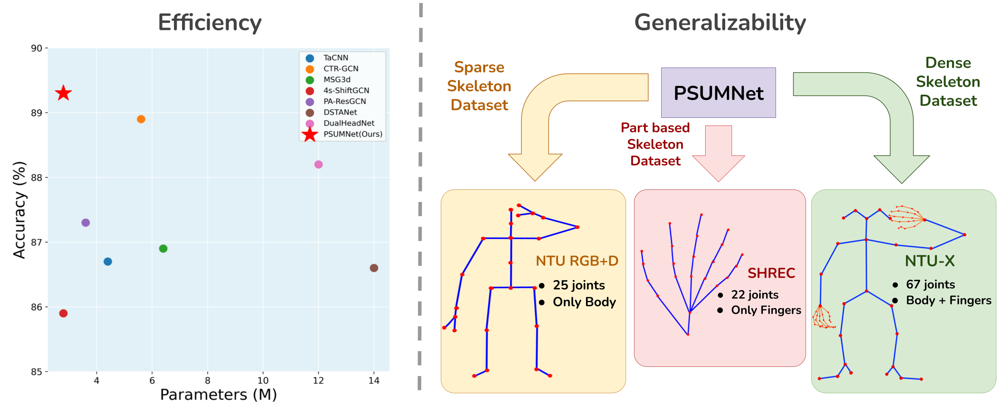
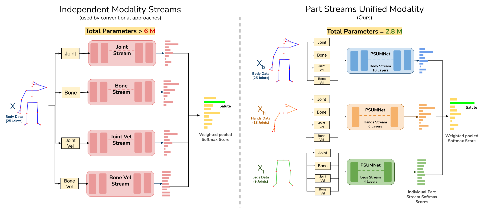
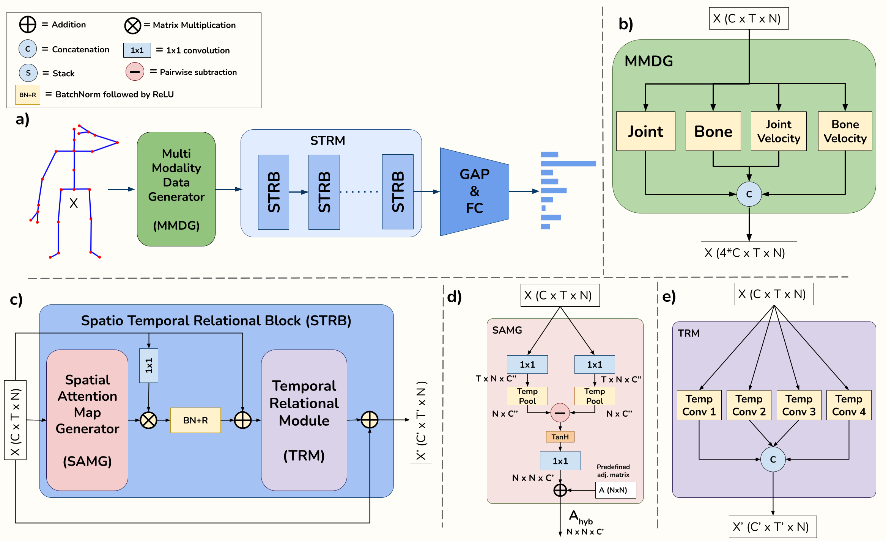

# PSUMNet: Unified Modality Part Streams are All You Need for Efficient Pose-based Action Recognition
Official pytorch implementation for PSUMNet for skeleton action recognition. Accepted at [ECCV 2022 WCPA](https://sites.google.com/view/wcpa2022/)



PSUMNet introduces unified modality part-based streaming approach compared to the conventional modality wise streaming approaches. This novel approach allows PSUMNet to achieve state of the art performance across skeleton action recognition datasets compared to competing methods which use around **100-400%** more parameters.




# Results

The following table compares the perfromance of PSUMNet with other existing methods on Cross Subject splits of [NTU60](https://github.com/shahroudy/NTURGB-D), [NTU120](https://github.com/shahroudy/NTURGB-D), [NTU60-X](https://github.com/skelemoa/ntu-x) and [NTU120-X](https://github.com/skelemoa/ntu-x) dataasets. 

<table>

<tr>
    <th>Model</th>
    <th># Params (M)</th>
    <th>FLOPs (G)</th>
    <th>NTU60</th>
    <th>NTU120</th>
    <th>NTU60-X</th>
    <th>NTU120-X</th>
</tr>

<tr>
    <td>PA-ResGCN</td>
    <td>3.6</td>
    <td>18.5</td>
    <td>90.9</td>
    <td>87.3</td>
    <td>91.6</td>
    <td>86.4</td>
</tr>

<tr>
    <td>MS-G3D</td>
    <td>6.4</td>
    <td>48.5</td>
    <td>91.5</td>
    <td>86.9</td>
    <td>91.8</td>
    <td>87.1</td>
</tr>

<tr>
    <td>4s ShiftGCN</td>
    <td>2.8</td>
    <td>10.0</td>
    <td>90.7</td>
    <td>85.9</td>
    <td>91.8</td>
    <td>86.2</td>
</tr>

<tr>
    <td>DSTA-Net</td>
    <td>14.0</td>
    <td>64.7</td>
    <td>91.5</td>
    <td>86.6</td>
    <td>93.6</td>
    <td>87.8</td>
</tr>

<tr>
    <td>CTR-GCN</td>
    <td>5.6</td>
    <td>7.6</td>
    <td>92.4</td>
    <td>88.9</td>
    <td>93.9</td>
    <td>88.3</td>
</tr>

<tr>
    <td><b>PSUMNet</b></td>
    <td><b>2.8</b></td>
    <td><b>2.7</b></td>
    <td><b>92.9</b></td>
    <td><b>89.4</b></td>
    <td><b>94.7</b></td>
    <td><b>89.1</b></td>
</tr>

</table>

<hr/>


## Sytem Requirements

Major requirements are as following,

- Python >= 3.6
- Pytorch >= 1.1.0

Rest of the requirements are specified in `requirements.txt` and can be installed using `pip install -r requirements.txt`. 

We trained our model using 4 1080Ti GPUs with 12 Gb RAM each.

## Datasets and preprocessing

We report results on the following datasets. 

- [NTURGB+d 60 and 120](https://rose1.ntu.edu.sg/dataset/actionRecognition)
- [NTU60x and NTU120x](https://github.com/skelemoa/ntu-x)
- [SHREC3d hand gestures datasets](http://www-rech.telecom-lille.fr/shrec2017-hand/)

The specific steps of processing these datasets are exmplained in the next sections.


### NTU RGB+D 60 and 120

1. Request dataset here: https://rose1.ntu.edu.sg/dataset/actionRecognition
2. Download the skeleton-only datasets:
   1. `nturgbd_skeletons_s001_to_s017.zip` (NTU RGB+D 60)
   2. `nturgbd_skeletons_s018_to_s032.zip` (NTU RGB+D 120)
   3. Extract above files to `./data/nturgbd_raw`

We use the same data preprocessing for NTU60 and NTU120 datasets as given by [CTR-GCN](https://github.com/Uason-Chen/CTR-GCN). Following are the steps to generate the NTU data from 

#### Generating Data

- Generate NTU RGB+D 60 or NTU RGB+D 120 dataset:

```
 cd ./data/ntu # or cd ./data/ntu120
 # Get skeleton of each performer
 python get_raw_skes_data.py
 # Remove the bad skeleton 
 python get_raw_denoised_data.py
 # Transform the skeleton to the center of the first frame
 python seq_transformation.py
 ```
<hr/>

### NTU60x and NTU120x

These extended versions of original NTURGB+d datasets are introduced [here](https://github.com/skelemoa/ntu-x). Once these datasets are downloaded specify their path in the corresponding config files [./config/ntux_configs/](./config/ntux_configs/). No specific preprocessing is needed to train PSUMNet on NTU60x and NTU120x.

<hr/>

### SHREC3d 
- Download the SHREC data from (here)[http://www-rech.telecom-lille.fr/shrec2017-hand/]
- Generate the train/test splits with `python data/shrec/gendata.py`

<hr/>

## Config Files

`./config/` contains the configuration files for all the part based streams (i.e body.yaml, hand.yaml, leg.yaml) for NTU kinect and NTU-X dataset

## Training

Once the data and the config files are set, the model training can be started using the following command,

```
python main.py --config <path of the config file>
```

## Inference

To use the model for inference using pre trained weights, use the following command,

```
python main.py --config <path of config file> --phase test --weights <path of pre trained weights>
```

## Ensemble

Once the model is trained for all the part streams and thier scores are saved in .pkl files, you can use [ensemble.py](./ensemble.py) file to compute final accuracy by specifying path of these score files.

To achieve the numbers mentioned in the paper, use the streams wise pickle files from [here](). The scores of each stream are weighted via a hyper paprameter alpha which we have decided experimentally. The alpha values corresponding to different dataset splits is mentioned in the comments of [ensemble.py](./ensemble.py). After adding the paths to scores pickle files and adjusting the alpha, run the following command to compute the final accuracy,

```
python ensemble.py
```


## Pretrained weights and scores files

Pretrained weights and scores for NTU 60/120 Cross Subject split can be found [here](https://drive.google.com/file/d/1trlUTJTuE7TdXarzVVAqTmnw52Z9MK8E/view?usp=sharing) for body stream. Scores files for all three streams for NTU60/120 and NTU60x/120x can also be found at this link. 

The provied score files along with the alpha values specified in [./ensemble.py](./ensemble.py) can be used to acquire the results as mentioned in the paper.

## Acknowledgements

This work is inspired from [CTR-GCN](https://github.com/Uason-Chen/CTR-GCN). We thank authors of this repo for their valuable contribution.